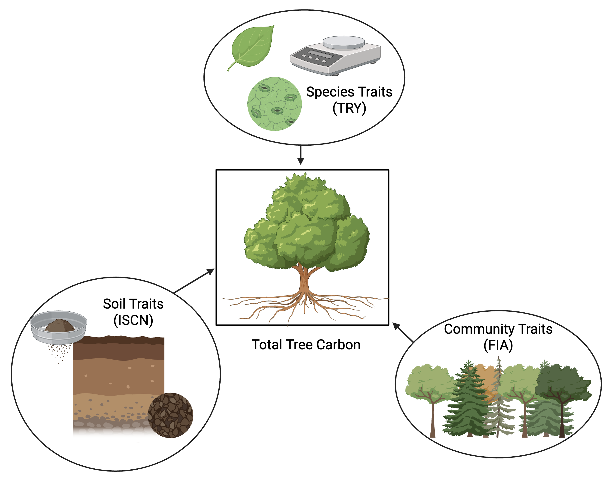

```{r setup, include=FALSE}
knitr::opts_chunk$set(echo = TRUE, warning = FALSE, message = FALSE)
```

### Introduction

Three datasets will be utilized: (1) Forest Inventory and Analysis (FIA) for Southeastern Alaska, (2) plant trait data from TRY for the tree species present in the FIA data, and (3) International Soil Carbon Network (ISCN) soil data. These data capture information from the biosphere and ecosphere at both the individual and community level.

My goal is to identify the best predictors of total tree carbon using plant trait data, FIA community data, and soil data. My learning outcome goal is to practice using random forest and/or boosted tree models. I'm going to see if I can use a boosted tree model because that is something that I need to learn for my research, but my backup is random forest. To be frank, I am more concerned with practicing bagging/random forest than extracting meaningful conclusions from the data or trying to produce statistically significant results.

More information on each dataset is below.

{width="413"}

### Data

I have not joined the 3 datasets together yet, but I did join the 2 different FIA datasets together & clean them.

```{r Libraries, message = FALSE, warning = FALSE}
library(tidyverse)
library(dplyr)
library(skimr)
library(ggplot2)
```

```{r Reading in Data}
fia_data <- read.csv("/Users/ameliarenner/Documents/EAES 480/Final Project/Data/nondecline_treeC.csv")
soildata <- read.csv("/Users/ameliarenner/Documents/EAES 480/Final Project/Data/ISCNprofiles_near_FIAplots - ISCNprofiles_near_FIAplots.csv")
fia_data2 <- read.csv("/Users/ameliarenner/Documents/EAES 480/Final Project/Data/non_decline_forestCstocks - non_decline_forestCstocks.csv")
trydata <- read.csv("/Users/ameliarenner/Documents/EAES 480/Final Project/Data/CTR_tree_trydat.csv")
```

```{r Data Cleaning}
# converted units 
fia_data <- fia_data %>%
  mutate(biomass.dead.C.gm2 = 100 * biomass.Mg.ha.dead, 
         biomass.live.C.gm2 = 100 * biomass.Mg.ha.live) %>%
  select(-biomass.Mg.ha.dead, -biomass.Mg.ha.live, -standingdead_C_Mg_ha, -livetree_C_Mg_ha, -BGtree_C_Mg_ha)

# removed columns that were in different units 
fia_data2 <- fia_data2 %>%
  select(-dwdC.tacre, -dwdC.Mgha, -AGunderstoryC.tacre, -AGunderstoryC.Mgha, -BGunderstoryC.Mgha, -BGunderstoryC.tacre, -litterC.Mgha, -litterC.tacre)

fia <- bind_rows(fia_data, fia_data2)

# making try data smaller so it's easier to pivot and join 
try <- trydata %>%
  select(AccSpeciesName, TraitName, OrigValueStr, OrigUnitStr)

# removing blank cells in TraitName
try[try == ""] <- NA
try <- na.omit(try)

# widened so that traits are columns instead of rows 
try2 <- try %>%
  group_by(AccSpeciesName) %>%
  pivot_wider(names_from = TraitName, values_from = OrigValueStr, id_cols = AccSpeciesName)
```

#### FIA

FIA data are collected on permanent plots around the US; this set is from Alaska. Each case is a tree measured in a plot in a year. The same trees are measured year after year. The variables relate to tree carbon storage; the ones I am most interested in are my outcome variable (total tree carbon) and a few of explanatory variables (downed woody debris, elevation, longitude/latitude, and forest type). Several variables in this dataset will be autocorrelated with the outcome variable - for example, aboveground biomass will affect total tree carbon because more aboveground biomass allows for more carbon storage. I will avoid using these variables because although they will likely be good predictors, they're not scientifically meaningful.

```{r}
skim(fia)
```

#### TRY

The TRY data are plant trait data collected from many, many global studies. The data table I have are for the tree species present in the FIA data. The question I am asking with these data is 'what physical traits might influence tree carbon storage?'. Each case represents a species from the FIA dataset. There are \~250 variables -- when I clean the dataset, these will greatly be reduced. The raw version is below because I haven't finished cleaning yet. In this, each trait of each plant is a separate row. I removed a lot of rows that didn't include traits recognized by TRY - ones that are hyperspecific to certain studies and would only apply to one of the five FIA species.

```{r}
skim(try)

```

#### ISCN

ISCN has an international soil database from thousands of global sites. The data have already been cleaned by Dr Murray so that the geographic scope is limited to that of the FIA data. Each row is a soil measurement. The variables I'm most interested in are soil taxon, bulk density, soil carbon, soil organic carbon, pH, soil composition metrics (percentages of sand, silt, and clay), and cation exchange capacity. Although these are the variables that I'm most interested in, there are \~100 variables in this dataset. I didn't include any of these data because they are very, very messy now and take up quite a bit of space.

### Data Analysis Plan

*Outcome variable* - total tree carbon (grams carbon / square meter)

*Predictor variables* - essentially everything in all three of the datasets, to start, except variables that are autocorrelated with total tree carbon in the FIA dataset. I am not tempted to remove anything now because I am treating this as an exploratory stage. I understand that is likely to lead to spurious correlations (and isn't great practice), but I am more inclined to attempt bagging rather than combing through \~300 variables. (...But, I will, if that is a nonnegotiable).

#### Preliminary Data Analysis

```{r}
fia %>%
  filter(total_treeC_gm2 < 4000000) %>%
  ggplot(aes(x = fct_reorder(foresttype, total_treeC_gm2), y = total_treeC_gm2)) + 
  geom_point() + 
  coord_flip() + 
  labs(x = "Forest Type", 
       y = "Total Tree Carbon (g C/m2)") + 
  theme_bw()

fia %>%
  filter(total_treeC_gm2 < 4000000) %>%
  ggplot(aes(x = biomass.dead.C.gm2, y = total_treeC_gm2)) + 
  geom_point() + 
  geom_smooth(method = "loess") + 
  labs(x = "Dead Biomass (g C/m2)", 
       y = "Total Tree Carbon (g C/m2)") + 
  theme_bw()
```

I used random forest once as an undergrad but the refresher has been really helpful. I want to try bagging because I want to learn it, but also because it seems an appropriate tool for a dataset of this magnitude (post-join). To support a claim that a predictor is of scientific merit, (1) I would need to find a statistically signifcant relationship between it and the outcome variable and (2) the relationship must make sense in context; otherwise, it's likely to be a spurious conclusion. I'd use Pearsons correlation if it's a numeric predictor variable and a t test if it's a numeric predictor.

### References

Myeong, S., Nowak, D. J., & Duggin, M. J. (2005). A temporal analysis of urban forest carbon storage using remote sensing. Remote Sensing of Environment, 101(2006), 277-282. <https://doi.org/10.1016/j.rse.2005.12.001>

Vollrodt, S., Frühauf, M., Haase, D., & Strohbach, M. (2012). The CO2 sink potential of urban trees in the context of post-reunification shrinkage processes. Hallesches Jahrbuch für Geowissenschaften, 34, 71-96. <https://public.bibliothek.uni-halle.de/hjg/article/view/136>
